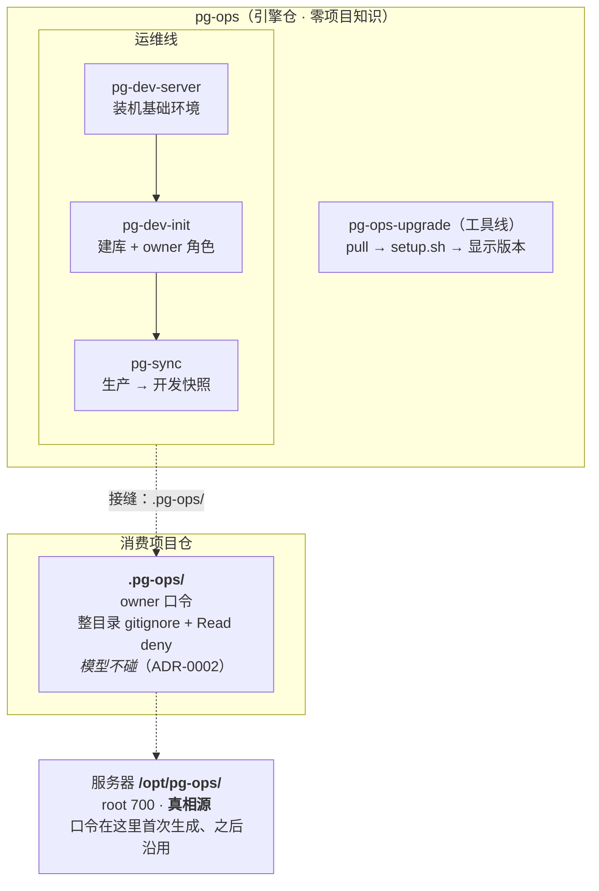
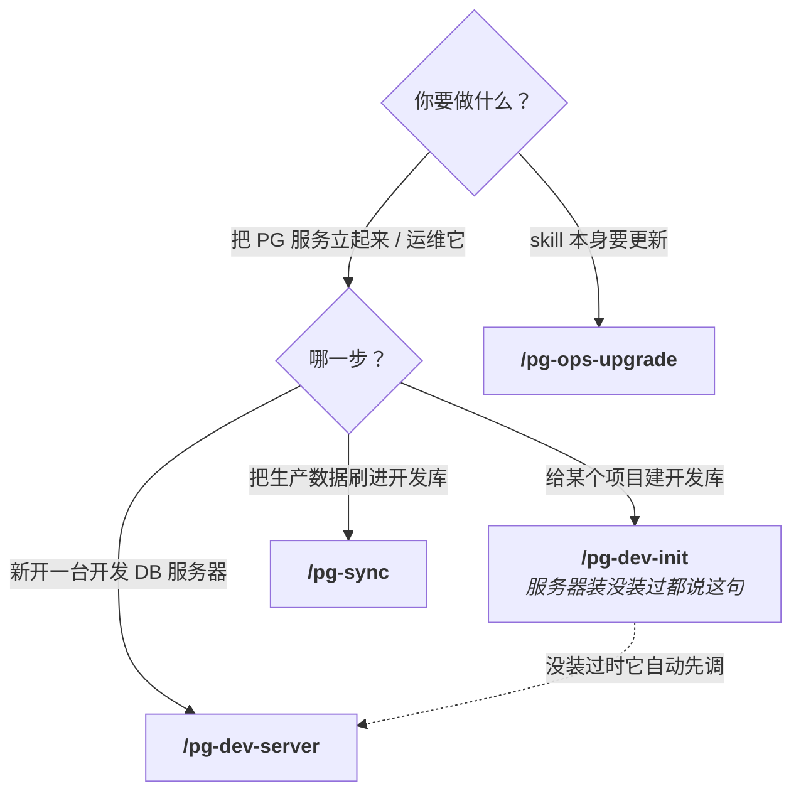
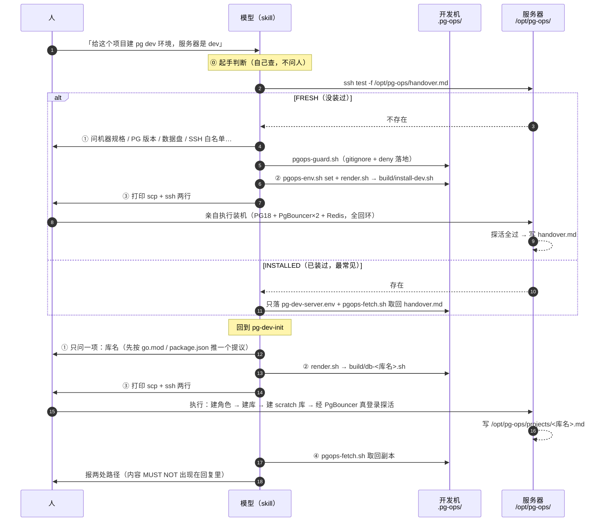
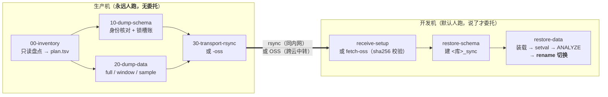
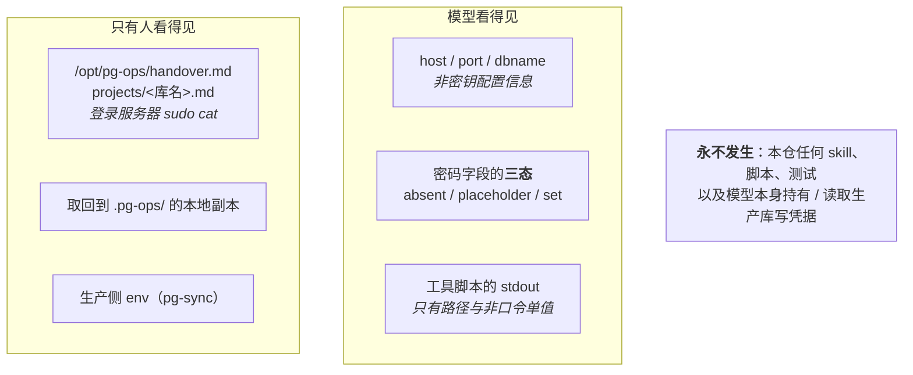

# pg-ops 使用说明（给人读）

本仓有 **3 个已实现的 skill**（另有 1 个升级工具 `pg-ops-upgrade`），管「把 PostgreSQL 服务本身
立起来并运维」这一条线。这份文档回答的是人的三个问题：**我该用哪个 · 按什么顺序 · 卡住了在哪一格**。

各 `SKILL.md` 是给 Claude / Codex 读的操作手册（参数表、退出码、MUST/MUST NOT），人不必看；
本页只讲人该做什么。已有的 [`quickstart.md`](./quickstart.md) 是三场景的照做清单，本页是它的上层地图。

> 前提：本机已按 [README「安装」](../README.md#安装) 装好 pg-ops。

---

## 1. 全景：一条线，一条接缝

运维线管「把 PostgreSQL 服务本身立起来并运维」——装机、建库建角色、备份同步。



接缝是本仓最重要的一条设计线索：模型对 `.pg-ops/` 的一切读写只经三个工具脚本
（`pgops-env.sh` / `pgops-fetch.sh` / `pgops-guard.sh`），真相源永远在**服务器**
`/opt/pg-ops/`，依据 ADR-0002。

---

## 2. 我该用哪个 skill



一句话触发表（在**项目仓根目录**对 Claude / Codex 说）：

| 你想做的事 | 说这句 | 会跑的 skill |
|---|---|---|
| 新开一台开发数据库服务器 | 「搭一台开发数据库服务器，ssh 别名是 `dev`」 | `pg-dev-server` |
| 给这个项目建开发库 | 「给这个项目建 pg dev 环境，服务器是 `dev`」 | `pg-dev-init`（自动调 `pg-dev-server` 前置检查） |
| 换开发库密码 | 「换一下开发库密码」 | `pg-dev-init` |
| 从生产拉快照到开发库 | 「从生产同步数据到 dev」 | `pg-sync` |
| 升级 skill 套件 | 「升级 pg-ops」 | `pg-ops-upgrade` |

**不要**手动一个个跑前置 skill——`pg-dev-init` 会自己调 `pg-dev-server` 做起手判断。人只说一句话。

---

## 3. 安装与升级

```bash
# 首次：运行 checkout 是真 clone，不软链到开发仓
git clone https://github.com/laodao-ai/pg-ops.git ~/.skills/pg-ops
bash ~/.skills/pg-ops/setup.sh          # 幂等；Unix symlink，Windows 合并拷贝
```

`setup.sh` 把 4 个 skill + `shared/` symlink 到 `~/.claude/skills/` 与 `~/.codex/skills/`，
任何 PG 项目全局可用。

之后升级说「升级 pg-ops」即可（`/pg-ops-upgrade`）：`git pull --ff-only` → `setup.sh` → 显示版本与最近 5 条变更。
退出码 `0` 成功 / `1` pull 层失败 / `2` setup 失败，每个失败分支都给 problem/cause/fix 三件套。

> **运行 checkout 只读**。改代码在另一份开发 checkout 里做、push 之后在运行机跑升级。
> 运行 checkout 被改过会导致非 ff，升级会停下报告而**不会**强推。

---

## 4. 运维线

### 4.1 三步走与「谁来执行」

运维线的固定交互模型：**skill 引导人填参 → 渲染出一份自包含脚本 → 默认打印命令由人上服务器执行**。
人明确说了「你来跑」才委托模型代跑。



### 4.2 三个 skill 各管什么

| skill | 管 | **不**管 |
|---|---|---|
| `pg-dev-server` | 服务器基础环境：PostgreSQL 18 + PgBouncer 两实例（6432 transaction / 7432 session，auth_query）+ Redis，全部只监听 127.0.0.1；另有加固（⑤）与只重写文档（⑥ `PG_OPS_DOCS_ONLY=1`）两个子模式 | 任何项目的库 / 角色；云安全组（控制台人工项）；生产 |
| `pg-dev-init` | 给一个项目建库 + owner 角色 + `<库名>_scratch` 库；也用于换密。**只需库名一项参数**，角色经 PgBouncer auth_query 自动可登录，项目侧零 PgBouncer 配置 | 装服务；跑项目迁移 / 灌数据 / 改项目配置（留在消费项目 `hack/`） |
| `pg-sync` | 生产 → 开发快照：schema 阶段与 data 阶段分开，只读 dump → rsync 或 OSS 传输 → dev 侧装载并 rename 切换 | 建库、管角色（前置要先跑过 `pg-dev-init`） |

一台服务器服务多个项目：`pg-dev-server` **只装一次**，之后每个项目各自 `pg-dev-init`，互不影响。

### 4.3 东西落在哪：两处目录，一处真相

```
 开发机：项目仓根 .pg-ops/                       服务器：/opt/pg-ops/（root 700，真相源）
 （整目录 gitignore + Read deny）
 +-----------------------------------+        +--------------------------------------------+
 | pg-dev-server.env  服务器参数      |        | handover.md        服务器交接文档（含口令） |
 | pg-dev-init.env    本项目建库参数  |  scp   | projects/<库名>.md 各项目库账号与连接串     |
 | build/*.sh         渲染的自包含脚本| -----> | bin/               装机/建库脚本，可原地重跑|
 | handover.md        交接文档副本    | <----- | bin/diag/          只读诊断脚本             |
 | projects/<库名>.md 项目库文档副本  | fetch  | postgres.pass      超级用户网络口令         |
 +-----------------------------------+        +--------------------------------------------+
```

- 口令在**服务器**首次生成、之后沿用；开发机不保存口令，副本只是取回给项目管理者看的。
- 想知道任何事 → `pgops-fetch.sh <host> <远端路径>` 取回成本地文件，
  **人自己 `cat`**。不用重跑任何脚本；真相在服务器上。
- 模型对 `.pg-ops/` 的所有读写只经三个工具脚本：`pgops-env.sh`（读/写/打星展示）、
  `pgops-fetch.sh`（取回远端文档）、`pgops-guard.sh`（幂等落 gitignore / claudeignore / settings deny）。

### 4.4 `pg-sync`：唯一「模型完全不参与执行」的一段



三条硬约束（不是建议）：

- **模型 MUST NOT 读生产侧 env**，也 MUST NOT 要求人把生产机的输出贴回会话（ADR-0001）。
  生产侧脚本渲染成「脚本 + 独立 env 模板」的 **bundle 目录**整个复制过去，敏感项由人在生产机上填。
- 每个生产侧脚本起手都过：身份核对 → 只读会话（`default_transaction_read_only=on`）→ 锁槽账 →
  磁盘账 → `--lock-wait-timeout` → `nice -n 19 ionice -c3`。任何一项不过就拒跑。
- `nice`/`ionice` 只限速 **客户端**（`pg_dump`/`psql`/`zstd`）进程，**不影响** PG 服务端 backend。
  服务端那边靠的是 `-t` include 清单、逐表短事务、`lock_timeout` 与人自己选错峰时段。

`DATA_RULES` 缺省是 `* full`（整库全量）——这是**故意的保守缺省**：遗漏一条规则的后果是「多同步了几张表」，
而不是「该同步的表悄悄被跳过」。要裁剪就显式加规则。

---

## 5. 凭据与安全边界



一句话记住每条边界：

| 边界 | 内容 |
|---|---|
| **凭据只走 `PGPASSWORD`** | 从不进 argv、从不字符串拼进 SQL。 |
| **口令不进模型输出** | `handover.md` / `projects/*.md` 的内容 MUST NOT 打到 stdout——模型的回复也是一种 stdout。 |
| **三道防线（Claude Code 宿主）** | 脚本不打 stdout → 人不 `cat` → `settings.json` 的 `Read(./.pg-ops/**)` deny。Codex 宿主没有第三道。`.claudeignore` 是消费方约定，**不算防线**。 |
| **生产守卫** | `PG_OPS_ROLE=dev` 缺失即拒跑；占位密码 `CHANGE_ME` 必须被拒；`pg-sync` dev 侧比对 `system_identifier` 拒绝同集群。 |
| **生产侧脚本** | 只生成 bundle、模型不读生产 env、不接触敏感值（ADR-0001）。 |

---

## 6. 卡住了？速查

| 现象 | 大概率原因 | 怎么办 |
|---|---|---|
| `pg-dev-init` 说 PgBouncer 是旧版 userlist 模式 | 目标机跑的 `pg-dev-server` 不是最新版 | 先升级 skill 再重跑一次装机（幂等） |
| 升级时报非 ff | 运行 checkout 被改过 | 运行 checkout 只读；改动应发生在开发 checkout |
| `pytest` 跑失败 | 装机 / 建库脚本本机只能语法检查（`bash -n`），MUST 在目标 Ubuntu 机上以 root 真跑验证 | 见 `CLAUDE.md`「常用命令」 |

---

## 7. 速查表

**3 个 skill + 1 个升级工具**

| skill | 线 | 一句话 |
|---|---|---|
| `pg-dev-server` | 运维 | 装一台开发 DB 服务器的基础环境（PG18 + PgBouncer×2 + Redis，全回环） |
| `pg-dev-init` | 运维 | 给一个项目建库 + owner 角色 + scratch 库（只需库名） |
| `pg-sync` | 运维 | 生产 → 开发快照，schema / data 两阶段 |
| `pg-ops-upgrade` | 工具 | 升级运行 checkout：pull → setup → 显示版本 |

**两份 ADR**（想知道「为什么这么设计」时读）

| ADR | 讲什么 |
|---|---|
| [0001](../docs/adr/0001-prod-side-scripts-are-bundles-model-never-reads-prod-env.md) | 生产侧脚本是 bundle，模型永不读生产 env |
| [0002](../docs/adr/0002-dev-side-model-never-touches-pg-ops-dir-io-via-helper-scripts.md) | dev 侧模型不碰 `.pg-ops/`，IO 经工具脚本 |

**相关文档**

- [`quickstart.md`](./quickstart.md) — 运维线三场景的照做清单
- [`runbook-pg-repack.md`](./runbook-pg-repack.md) / [`runbook-pg-major-upgrade-16-to-18.md`](./runbook-pg-major-upgrade-16-to-18.md) — 两份运维 runbook
